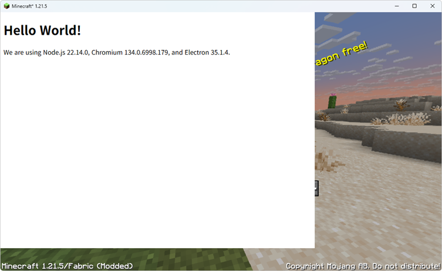

[![Npm][npm-badge]][npm-url]
[![Crates.io][crates-badge]][crates-url]
[![Documentation][docs-badge]][docs-url]

[npm-badge]: https://img.shields.io/npm/v/asdf-overlay-node.svg
[npm-url]: https://www.npmjs.com/package/asdf-overlay-node
[crates-badge]: https://img.shields.io/crates/v/asdf-overlay-client.svg
[crates-url]: https://crates.io/crates/asdf-overlay-client
[docs-badge]: https://docs.rs/asdf-overlay-client/badge.svg     
[docs-url]: https://docs.rs/asdf-overlay-client

# Asdf Overlay
Blazingly fast™ Overlay library for Windows



## Supported API
* [x] OpenGL
* [x] DX9
* [ ] DX10
* [x] DX11
* [x] DX12
* [ ] Vulkan

## Pre-requirement
1. node, pnpm package manager
2. nightly rustc, cargo, msvc(x64, x86, arm64)
3. Install x86_64-pc-windows-msvc, i686-pc-windows-msvc, aarch64-pc-windows-msvc rustc targets

### Installing node dependencies
```bash
pnpm install
```

### Build
```bash
pnpm build
```

> [!WARNING]
> DLL and the client must be built using same rust compiler or it may misbehaviour

## Example
Examples are located in `examples` directory.

### Node
To be added...

### Rust
Run
```bash
cargo build && cargo run -p noise-rectangle <process_name>
```
Glitching squares appear and disappear on target process

## Debugging
Run with debug build.
Use external debug log viewer (ex: `DebugView`) to see tracing log of injected process

## License
This project is dual licensed under MIT or Apache-2.0 License
