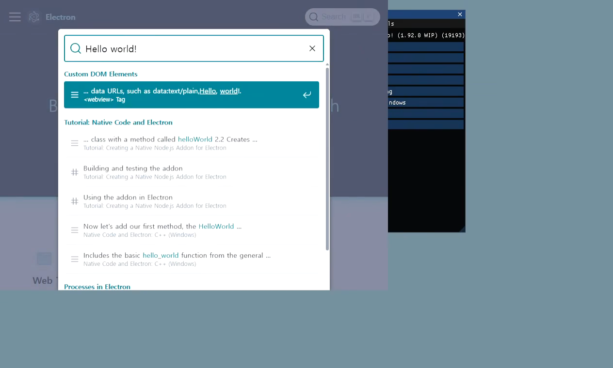
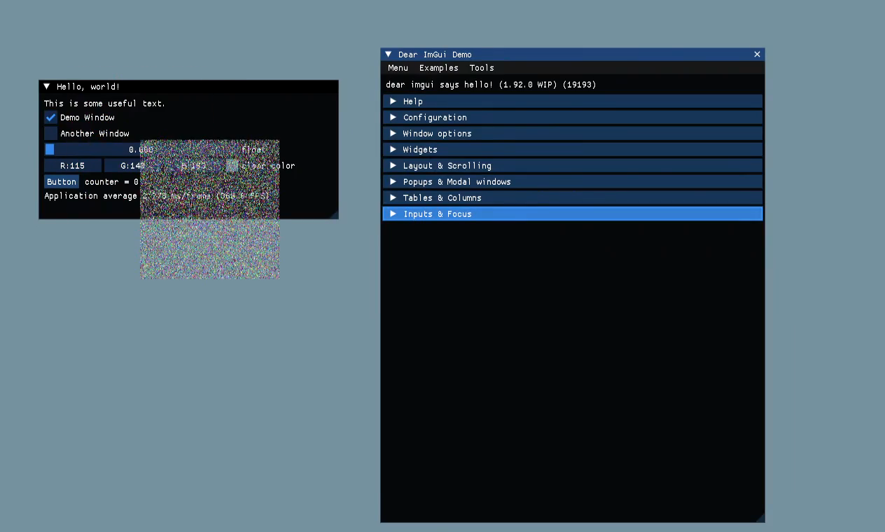

[![Npm][npm-badge]][npm-url]
[![Crates.io][crates-badge]][crates-url]
[![Documentation][docs-badge]][docs-url]

[npm-badge]: https://img.shields.io/npm/v/@asdf-overlay/core.svg
[npm-url]: https://www.npmjs.com/package/@asdf-overlay/core
[crates-badge]: https://img.shields.io/crates/v/asdf-overlay.svg
[crates-url]: https://crates.io/crates/asdf-overlay
[docs-badge]: https://docs.rs/asdf-overlay/badge.svg     
[docs-url]: https://docs.rs/asdf-overlay

# Asdf Overlay
Blazingly fast™ In-Game Overlay library for Windows.

[Documentation](https://storycraft.github.io/asdf-overlay/)

## Features
* Zero copy overlay rendering.
* Window input capturing and blocking control.
* Multi window, multi surface support.
* Renderer detection, multi-API support (DirectX 9, DirectX 11, DirectX 12, OpenGL, Vulkan)
* Code signed overlay DLL.

## Used by
[lyrs-url]: https://github.com/organization/lyrs
[tosu-url]: https://github.com/tosuapp/tosu

| Logo | Project
| :-----: | ----- |
| [][lyrs-url] | [Lyrs][lyrs-url] |
| [][tosu-url] | [Tosu][tosu-url] |

## Sponsorship
[sign-path-io-url]: https://signpath.io/
[sign-path-foundation-url]: https://signpath.org/

| Logo | Description |
| :-----: | ----- |
| [][sign-path-io-url] | Free code signing provided by [SignPath.io][sign-path-io-url], certificate by [SignPath Foundation][sign-path-foundation-url] |

## Example
Examples are located in `examples` directory.

### Node
Run
```bash
pnpm build && pnpm --filter ingame-browser start <process_name>
```
Pressing `Left Shift + A` will show ingame browser overlay and input will be redirected to browser window. Pressing again will close it.



### Rust
1. Run
```bash
pnpm build && cargo run -p noise-rectangle <pid>
```
Glitching squares appear and disappear on target process.



1. Run
```bash
pnpm build && cargo run -p input-capture <pid>
```
It will listen all inputs of the target process and block them until the process exit.

## License
This project is dual licensed under MIT or Apache-2.0 License

[](https://app.fossa.com/projects/git%2Bgithub.com%2Fstorycraft%2Fasdf-overlay?ref=badge_large&issueType=license)
